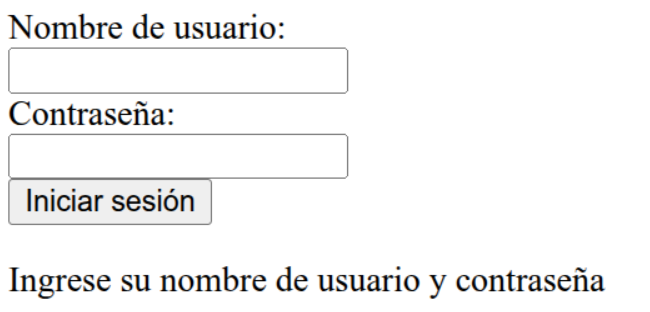
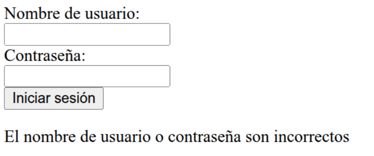
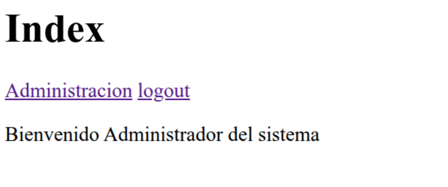
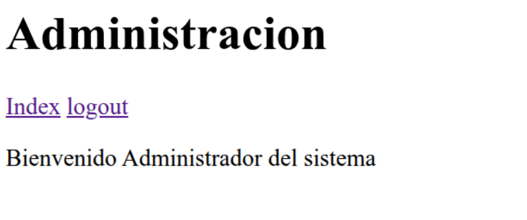

# Web.py Sessions

Demo de python, web.py para el manejo de sesiones basado en el COOKBOOK de web.py [Manejo de sesiones](https://webpy.org/cookbook/sessions)

## 1. Ambiente virtual

Como requerimiento de Python 3.12 y posteriores es necesario crear un virtual environment para la instalación de las librerías necesarias.

### 1.1 Crear el ambiente virtual

Desde con consola o terminal se ejecuta el siguiente comando para crear el virtual environment.

```shell
python3 -m venv .venv
```


### 1.2 Inicializar el ambiente virtual

Una vez creado el virtual environment se activa utilizando el siguiente comando:

```shell
source .venv/bin/activate
```

### 1.3 Actualizar pip

Una recomendación es que el primer paso después de crear y activar el virtual environment es actualizar el gestor de paquetes de python (PIP).

```shell
pip install --upgrade pip
```

### 1.4 Instalar las librerias necearias

Después de actualizar pip se instalan las librerías necesarias para la ejecución de la aplicación utlizando el siguiente comando:

```shell
pip install -r requirements.txt
```


## 2. Crear la base de datos en SQLite3

Para este ejemplo se utiliza SQLite3 como Base de Datos.

### 2.1 Creación de la base de datos

Se crea la base de datos demo para validar usuarios en el sistema

```shell
sqlite3 base_demo.db < base.sql 
```

En este ejemplo se tienen dos usuarios:

- **username**:admin **password**:1234
- **username**:user **password**:4321

**NOTA**: Las ontraseñas está cifradas con SHA1.

```sql
.headers on
.mode columns

CREATE TABLE IF NOT EXISTS users (
        username TEXT NOT NULL,
        name TEXT NOT NULL,
        password TEXT NOT NULL
    );

--username:admin,password:1234
--username:user,password:4321
INSERT INTO users(username,name,password) VALUES
('admin','Administrador del sistema','7110eda4d09e062aa5e4a390b0a572ac0d2c0220'),
('user','Usuario del sistema','d5f12e53a182c062b6bf30c1445153faff12269a');

SELECT * FROM users;
```

## 3. Descripción del sistema


Para iniciar la aplicación se utiliza el siguiente comando

```shell
python3 app.py
```

Opcionalemente se puede indicar el **puerto** en el que se desea habilitar el sistema usando el siguiente comando:

```shell
python3 app.py 80
```

### 3.1 Login

El sistema inicia con una página de login para introducir **username** y **password**.



### 3.2 Datos incorrectos

En caso de que el **username** ó el **password** no coincidan con los registros alamacenados en la base de datos mostrar el login con un mensaje de error.



### 3.3 Index

Si los datos de **username** y **password** son correctos el sistema redirecciona a **index**, esta página valida si hay una sesión iniciada, y en caso de que así sea muestra el nombre del usuario.



### 3.4 Administración

Está página es similar a **index** y sirve para mostrar que el **nombre** quedo almacenado en la **sesión** puede ser accedido desde cualquier página del sistema.

